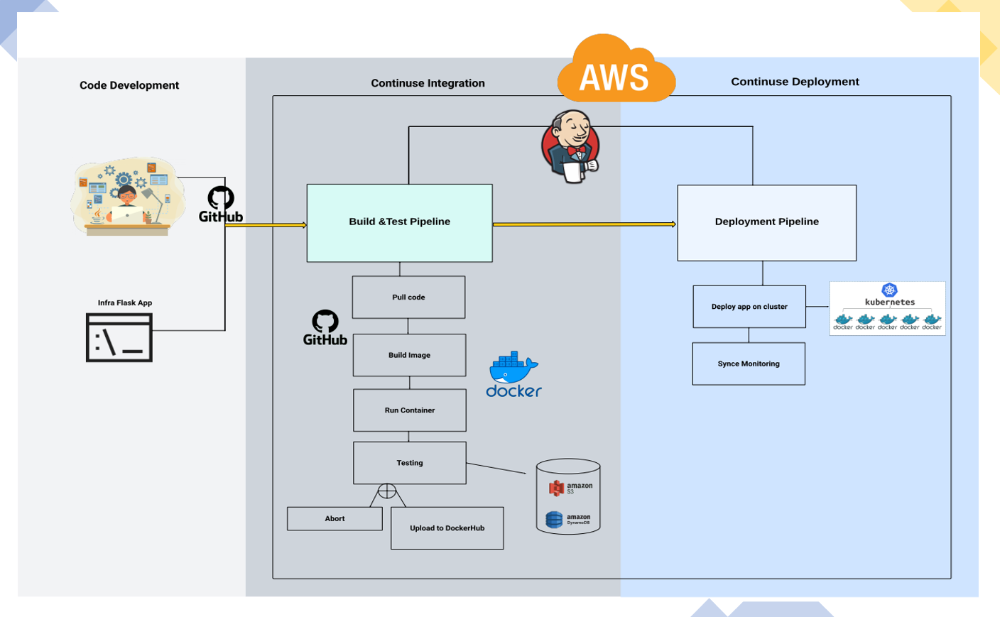

# Flask on EKS: A CI/CD Journey

## Table of Contents
1. [Overview](#overview)
2. [Architecture](#architecture)
3. [Built With](#built-with)
4. [Authors](#authors)

## Overview
Flask on EKS: A CI/CD Journey is a web application built with Flask and designed for containerization and cloud deployment on AWS EKS (Elastic Kubernetes Service). The main goal of this project is to establish a pipeline that allows for continuous integration and deployment, as well as scalability and manageability using AWS services and Kubernetes.

## Architecture

This project employs a microservices architecture. The core service is a Flask web application containerized using Docker. Jenkins is utilized for CI/CD, automatically testing the application, building Docker images, and deploying them on AWS EC2 instances for production.

Kubernetes is also used for managing deployment on an Amazon EKS cluster, ensuring scalability and robustness of the application. The deployment pipeline includes features such as automatic scaling based on traffic and comprehensive logging and monitoring using Prometheus and Grafana.

## Built With
- Flask - A micro web framework written in Python.
- Docker - An open platform for developing, shipping, and running applications inside software containers.
- Jenkins - An open source automation server which enables developers to reliably build, test, and deploy their software.
- AWS Services (EC2, S3, DynamoDB, CloudWatch) - A collection of cloud services offered by Amazon Web Services.
- Kubernetes - An open-source system for automating deployment, scaling, and management of containerized applications.
- Prometheus, Grafana - Used for monitoring and visualizing metrics from the Kubernetes cluster.

## Authors
- Inbal Rozenfeld - Initial work - [YourGitHubProfile](https://github.com/YourGitHubProfile)

See also the list of [contributors](https://hub.docker.com/u/puki121) who participated in this project.
